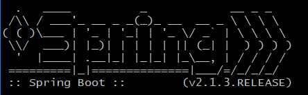
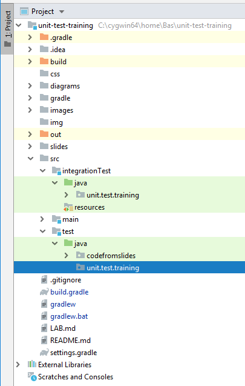
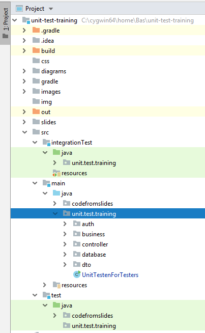

# LAB opdracht

Voer de volgende commando's uit op de commandline (MacOS):

```
git pull
./gradlew clean bootRun
```

Voer de volgende commando's uit op de commandline (Windows):

```
git pull
gradlew clean bootRun
```

Er verschijnt nu o.a. het volgende logo in beeld:



Laat dit commando gewoon draaien en ga ondertussen met een browser naar het volgende adres: http://localhost:8080

Daar kan je de demo-applicatie bekijken waarvoor we in dit lab de Unit Tests gaan uitbreiden 👍

Als je wat hebt rondgeklikt in de applicatie en weet wat het ongeveer moet doen functioneel, dan wordt het tijd om eens naar de bestaande Unit Tests te gaan kijken. 
Zoek in IntelliJ de volgende package op:



De productiecode is op de volgende locatie terug te vinden:



## Opdracht
👉 Er zitten nog wat subtiele fouten in de code, kan jij er zoveel mogelijk aantonen met een goede unit test?
## Business requirements
Natuurlijk is deze applicatie voor Acme Corp en zijn er uitgebreide requirements opgesteld:

👉 [REQUIREMENTS KLIK HIER](REQUIREMENTS.md)

