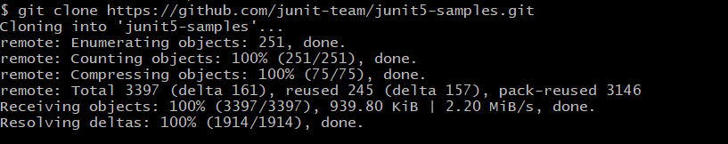

### 🛈 Heb je deze setup al gedaan en zoek je de lab-opdracht: [Klik dan hier](LAB.md)

# Set-up lab 'Introductie Unittesten'

## Installatie Git
Om altijd eenvoudig de laatste versie van het voorbeeldproject op te kunnen halen gebruiken we Git als versiebeheer.
Via GitHub kan je dan altijd bij de laatste versie van dit voorbeeldproject dat bij de cursus hoort.

Voor de volledigheid staat hieronder nog een handleiding om je eigen PC goed in te richten voor het werken aan dit project.

### Git op Windows
installeer [Git for Windows](https://git-scm.com/download/win). 


Kies vervolgens een installatielocatie en klik 3x op 'Next'.

Kies vervolgens je favoriete editor (niet nodig voor de labs) en kies voor de volgende optie als daarom gevraagd wordt:


Vervolgens kan je de wizard afronden door alle defaults verder te accepteren.

Als de installatie is afgerond kan je het Git Bash window openen:


Test de installatie uit door vanuit Git Bash een willekeurige repo te klonen, bijv. deze repo of de volgende repo op github met JUnit-5 voorbeelden:
```
git clone https://github.com/junit-team/junit5-samples.git
```

Dit zou er ongeveer zo uit moeten zien:




### Git op MacOS
Voor MacOS zijn er verschillende manieren om git te installeren. Zie daarvoor de volgende website: [Git install op MacOS](https://git-scm.com/book/en/v1/Getting-Started-Installing-Git#Installing-on-Mac)


## Installatie JDK
Om te beginnen is er een JDK nodig, Java 8 of hoger.

Op Windows:
Installeer bijv. java 8 via Chocolately (een windows package manager) de volgende package https://chocolatey.org/packages/jdk8/8.0.201:
```
choco install jdk8
```

Of op MacOS via Homebrew:
```
brew tap caskroom/versions
brew cask install java8
```

Controleer in ieder geval dat de environment variable 'JAVA_HOME' naar de directory wijst waarin de JDK geinstalleerd is. 
In windows kan dat bijv. via het volgende scherm:


## Installatie IntelliJ
ALs IDE wordt IntelliJ aangeraden, zie de volgende locatie voor de installatiebestanden voor jouw PC: https://www.jetbrains.com/idea/download/


### Configuratie JDK IntelliJ
Als je IntelliJ voor de eerste keer opstart zie je het volgende scherm.
Klik hierbij op 'Configure'


Klik vervolgens op het menu-item 'Project Structure':


In het volgend scherm kan de JDK-versie worden geconfigureerd:


Klik hier op 'New' en vul in het volgende scherm het pad in naar de JDK-installatiemap.


Controleer vervolgens dat het Language-level minimaal op Java-8 staat ingesteld:


🎉🎉 Gefeliciteerd! Je PC is nu goed ingericht voor het lab 🎂

### MacOS/Linux:
Vervolgens kan je deze repository ophalen d.m.v. een git clone en de software bouwen met Gradle (buildtool) door de volgende commando's uit te voeren:
```
git clone https://github.com/praegus/intro-unittesten.git

cd intro-unittesten

./gradlew clean build
```

### Windows:
Vervolgens kan je deze repository clonen en bouwen door de volgende commando's uit te voeren:
```
git clone https://github.com/praegus/intro-unittesten.git

cd intro-unittesten

gradlew clean build
```
